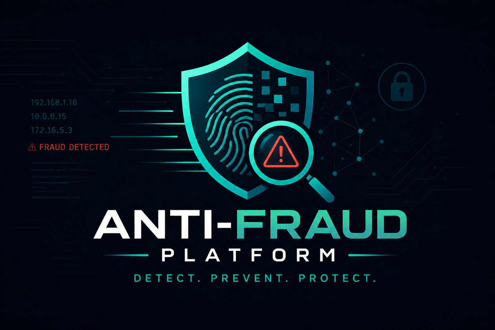
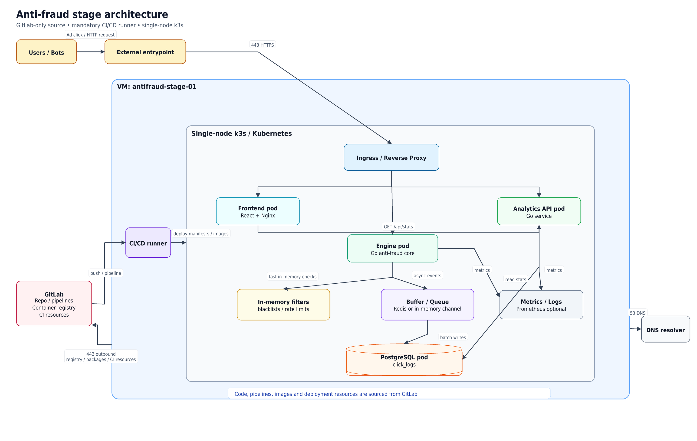
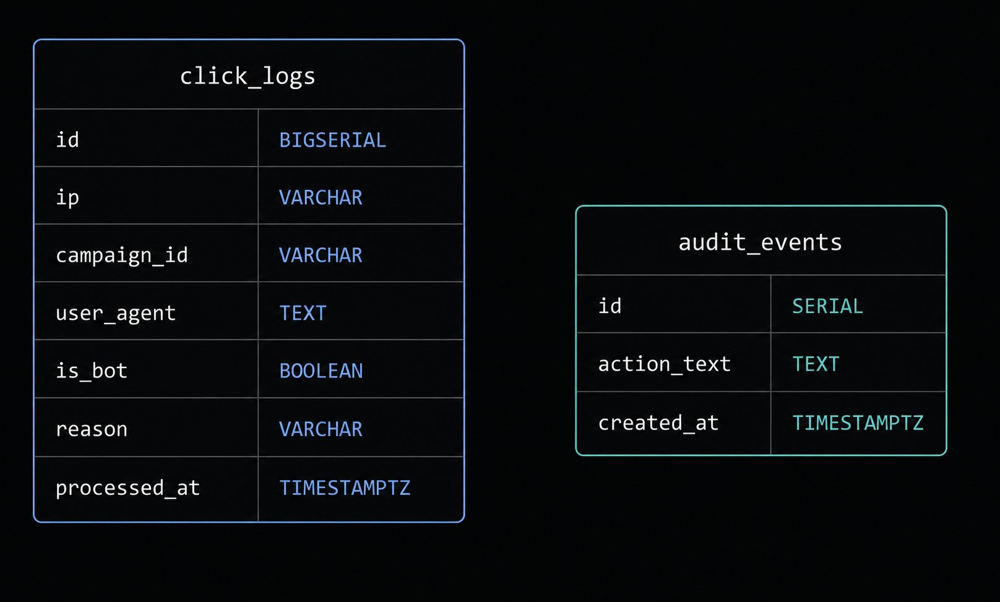
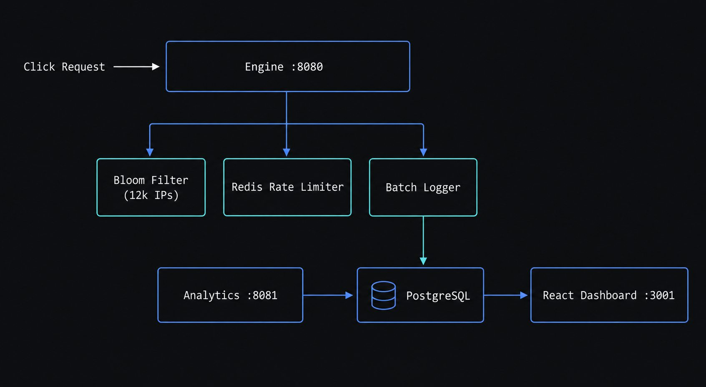
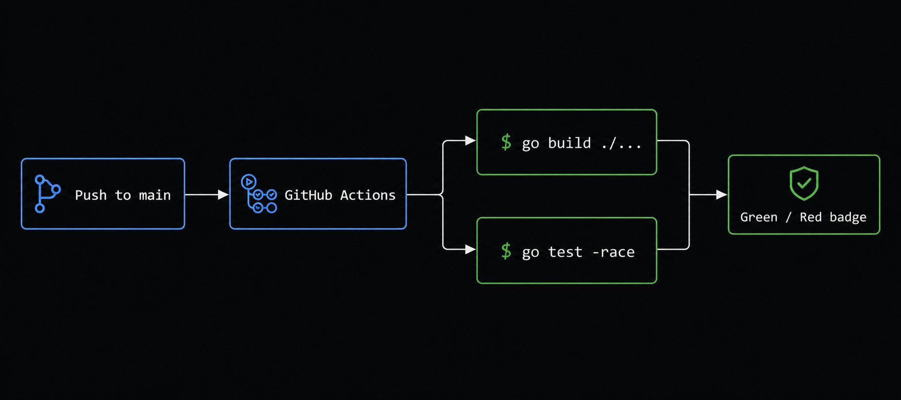

# Anti-Fraud Platform



Real-time click fraud detection for ad traffic. Built with Go, Redis, PostgreSQL and React.

Each click goes through four checks: automated user-agent detection, a Bloom filter against 12,000 known bad IPs, a Redis rate limiter (5 req/s per IP), and an async batch logger that writes to Postgres every 500ms. A separate analytics service reads from the same DB and powers the dashboard.



## Stack

| Service | Port | What it does |
|---|---|---|
| engine | 8080 (internal only) | Accepts clicks, runs fraud checks |
| nginx_engine | 9090 | Reverse proxy in front of the engine, serves the click simulator page |
| analytics | 8081 | REST API over click_logs |
| frontend | 3001 | React dashboard, polls every 2.5s |
| postgres | 5433 | Stores all click logs |
| redis | 6380 | Per-IP rate limit counters |

The engine no longer exposes a port directly to the host. All click traffic goes through nginx on port 9090.

## Database

PostgreSQL is the only persistent store. The schema is in `deployments/init-db.sql` and runs automatically on first `docker compose up`.

Two tables:

`click_logs` stores every click that hits the engine, both allowed and blocked. The `reason` column holds one of four values: `allowed`, `rate_limit_exceeded`, `static_blacklist`, or `suspicious_agent`. Indexes on `ip`, `campaign_id`, and `processed_at` keep the analytics queries fast even at high row counts.

`audit_events` stores system events for the activity feed. Empty by default, populated manually or via an application hook.

Connect directly to inspect:

```bash
docker exec -it antifraud-postgres psql -U antifraud -d analytics
```

Useful queries:

```sql
-- total rows
SELECT count(*) FROM click_logs;

-- breakdown by reason
SELECT reason, count(*) FROM click_logs GROUP BY reason;

-- top blocked IPs
SELECT ip, count(*) as hits FROM click_logs
WHERE reason = 'static_blacklist'
GROUP BY ip ORDER BY hits DESC LIMIT 10;
```



To wipe all data and start fresh:

```bash
docker compose down -v
docker compose up --build
```

## Getting started

### Prerequisites

You need Go 1.26+, Docker with Compose support, and Git.

```bash
go version
docker --version
docker compose version
git --version
```

### 1. Clone and build

```bash
git clone git@github.com:kage-ops-dev/anti-fraud-platform.git
cd anti-fraud-platform
docker compose up --build -d
```

<<<<<<< HEAD
If SSH access to GitHub is not configured on the machine, use HTTPS instead:

```bash
git clone https://github.com/anti-fraud-platform/anti-fraud-platform.git
cd anti-fraud-platform
```

Start the full local stack:
=======
This builds and starts six containers: `engine`, `nginx_engine`, `analytics`, `frontend`, `postgres`, `redis`. The first build takes 1-3 minutes depending on your machine; subsequent runs are faster since Docker caches layers.

### 2. Confirm everything is healthy
>>>>>>> main

```bash
docker compose ps
```

Expected output, all six services `Up` (postgres and redis should additionally say `(healthy)`):

```
NAME                     SERVICE        STATUS
antifraud-analytics      analytics      Up
antifraud-engine         engine         Up
antifraud-frontend       frontend       Up
antifraud-nginx-engine   nginx_engine   Up
antifraud-postgres       postgres       Up (healthy)
antifraud-redis          redis          Up (healthy)
```

Note that `antifraud-engine` has no host port mapped (only `8080/tcp` internal). That's correct, the engine is intentionally not reachable directly. All click traffic goes through `nginx_engine` on port 9090.

If any container shows `Restarting` or `Exited`, check its logs:

```bash
docker compose logs <service-name>
```

### 3. Access the UI

| What | URL |
|---|---|
| Dashboard | http://localhost:3001 |
| Click simulator | http://localhost:9090 |

Open the dashboard first, you should see four stat cards (Total clicks, Blocked bots, Money saved, Budget saved) all showing `0` on a fresh database, updating automatically every 2.5 seconds via polling.

Open the click simulator in a separate tab and click both buttons a few times. Within a couple seconds, refresh the dashboard and confirm the numbers moved.

### 4. Verify via terminal

Generate some click traffic through nginx and check it landed in the database:

```bash
# normal click
curl -s -X POST http://localhost:9090/click -H "Content-Type: application/json" -d '{"campaign_id":"demo"}'
```

Expected response:

```json
{"status":"success","message":"Click registered, routing to verification queue"}
```

```bash
# simulated bot click
curl -s -X POST http://localhost:9090/bot/click -H "Content-Type: application/json"
```

Expected response:

```json
{"status":"flagged","message":"Click accepted for validation analysis pipeline"}
```

Confirm the engine itself is not reachable directly (this should fail to connect, not return an error JSON):

```bash
curl -i http://localhost:8080/v1/click
```

Expected:

```
curl: (7) Failed to connect to localhost port 8080
```

Check the rows landed in Postgres:

```bash
docker exec -it antifraud-postgres psql -U antifraud -d analytics -c \
  "SELECT ip, reason, is_bot, user_agent FROM click_logs ORDER BY processed_at DESC LIMIT 5;"
```

Expected: one row with `reason = allowed, is_bot = f` and one row with `reason = suspicious_agent, is_bot = t`, with the second row's `user_agent` showing the forced `python-requests/2.28...` string.

Confirm the analytics API picked it up:

```bash
curl -s http://localhost:8082/v1/analytics/stats | python3 -m json.tool
```

`total_clicks` should now be at least 2, and `blocked_count` should reflect the bot click.

### 5. Run the test suite

```bash
go build ./...
go test $(go list ./... | grep -v frontend) -race -count=1
```

Expected: all packages report `ok`, no `FAIL`. See the [Tests](#tests) section below for what each test proves.

### 6. Run the load test (optional but recommended)

```bash
go run ./cmd/generator/ -attack -workers 10 -duration 30s
```

Expected: catch rate above 99% by the end, 429s dominating the output after the first second. See [Traffic generator](#traffic-generator) below for full expected output.

### Tearing down

```bash
docker compose down        # stop containers, keep data
docker compose down -v     # stop containers, wipe Postgres volume too
```

Full setup guide with additional troubleshooting: [docs/SETUP.md](docs/SETUP.md)

## Sending a click

The engine is not reachable directly. All clicks go through nginx on port 9090.

```bash
curl -X POST http://localhost:9090/click \
  -H "Content-Type: application/json" \
  -d '{"campaign_id":"demo"}'
```

| Response | Reason |
|---|---|
| 200, status: success | Click accepted |
| 200, status: flagged | Automated/bot user-agent detected, logged but not blocked |
| 403 | IP is on the static blacklist |
| 429 | More than 5 requests per second from this IP |


## Click simulator

A small page served by nginx at `http://localhost:9090` for testing the detection logic without writing curl commands. Two buttons:

`Send Manual Click` proxies to `/click` with a real browser User-Agent.

`Simulate Bot Attack` proxies to `/bot/click` with a forced `python-requests` User-Agent and an `X-Click-Source: automated` header.

The engine doesn't trust either signal on its own. It independently checks the User-Agent against known bot patterns (`curl`, `python-requests`, `go-http-client`, `bot`, `spider`, `wget`, or empty) before checking the blacklist or rate limiter, so the same detection fires whether the request came through the simulator or a raw curl call with a suspicious UA.

## Traffic generator

```bash
# Normal traffic, 10 workers at 10 rps for 30 seconds
go run ./cmd/generator/ -workers 10 -rps 10 -duration 30s

# Attack simulation, one IP hammering at 1000 rps
go run ./cmd/generator/ -attack -workers 10 -duration 30s
```

Normal mode output from our tests:

```
Total Requests Sent : 2980
Clean Clicks (200)  : 2968
Rate-Limit Hits(429): 0
Blacklist Hits (403): 12
```

Attack mode output:

```
Total Requests Sent : 28412
Clean Clicks (200)  : 150
Rate-Limit Hits(429): 28262
Overall Catch Rate  : 99.5%
```

## Tests

```bash
go test $(go list ./... | grep -v frontend) -race -count=1
```

```
ok   anti-fraud/cmd/engine        1.8s
ok   anti-fraud/internal/bloom    1.4s
ok   anti-fraud/internal/engine   1.5s
```

Notable tests:

- `TestHandleClickIgnoresSpoofedBodyIP` - confirms the body `ip` field is ignored, rate limiting always uses the real connection IP
- `TestHandleClickSelfHealsKeyMissingTTL` - confirms a Redis key that lost its TTL recovers automatically via ExpireNX on the next request
- `TestHandleClickSuspiciousAgentDetection` - confirms bot user-agents (curl, python-requests, empty UA, explicit automated header) are all flagged correctly
- `TestIPFilter_LogicAndMemory` - Bloom filter loads 12,000 IPs with 0 bytes of unexpected memory growth
- `TestClickIntegrationPipeline` - full HTTP round trip against a real Redis instance


## Analytics API

### GET /v1/analytics/stats

```json
{
  "total_clicks": 315936,
  "allowed_count": 15679,
  "blocked_count": 300257,
  "budget_saved": 1501285,
  "top_blocked_ips": [
    { "ip": "1.2.3.4", "count": 28154 }
  ],
  "campaigns": [
    {
      "campaign_id": "camp_alpha_001",
      "total_clicks": 52341,
      "blocked_bots": 48120,
      "saved_money_usd": 240600
    }
  ]
}
```

### GET /v1/analytics/logs

Paginated click log. Query params: `page`, `limit`, `campaign_id`, `is_bot`, `reason`, `from`, `to`.

`reason` accepts `allowed`, `rate_limit_exceeded`, `static_blacklist`, or `suspicious_agent`.

`from` and `to` accept RFC3339 or `YYYY-MM-DD` format.

### GET /v1/analytics/blacklist/ips

Only includes IPs blocked via the static blacklist (`reason = static_blacklist`). Clicks flagged by user-agent detection don't appear here, they're visible through `/v1/analytics/logs` filtered by `reason=suspicious_agent`.

```json
{
  "items": [
    {
      "ip": "87.32.171.138",
      "block_count": 3,
      "first_blocked": "2026-06-29 19:36",
      "last_blocked": "2026-06-30 01:12"
    }
  ],
  "total": 12
}
```

### GET /v1/analytics/blacklist/summary

```json
{
  "total_blocked": 300257,
  "static_blacklist": 43,
  "rate_limited": 300214,
  "auto_blocked_24h": 39
}
```

### GET /v1/analytics/trend

7 day breakdown for the trend chart.

```json
{
  "data": [
    {
      "date": "2026-06-28",
      "total_clicks": 315936,
      "allowed_count": 15679,
      "blocked_count": 300257
    }
  ]
}
```

### GET /v1/analytics/events

Last 20 audit events. Requires rows in the `audit_events` table.



## CI

GitHub Actions runs on every push to main and every pull request targeting main.

The backend job spins up Redis 7, then runs:

```bash
go build ./...
go test $(go list ./... | grep -v frontend) -race -count=1
```

See [.github/workflows/ci.yml](.github/workflows/ci.yml).



## Conclusion

The platform was built and verified end to end over several weeks as a team. The engine handles sustained attack traffic at 1000 rps with a 99.5% catch rate and flat memory at around 36 MB over 10 minute runs. Three real bugs were found and fixed during testing: a rate limiter that trusted the client-supplied IP in the request body (letting bots spoof their way past it), a Redis TTL race condition that could permanently block an IP even after the attack stopped, and a missing User-Agent on the manual click route that caused legitimate API testing to be misclassified as bot traffic. All three have regression tests that will catch them if they come back. The engine also now detects automated traffic by user-agent before it reaches the blacklist or rate limiter, independent of any client-supplied headers. CI runs on every push to main and covers build, race detection, and the full test suite including HTTP integration tests against real Redis.