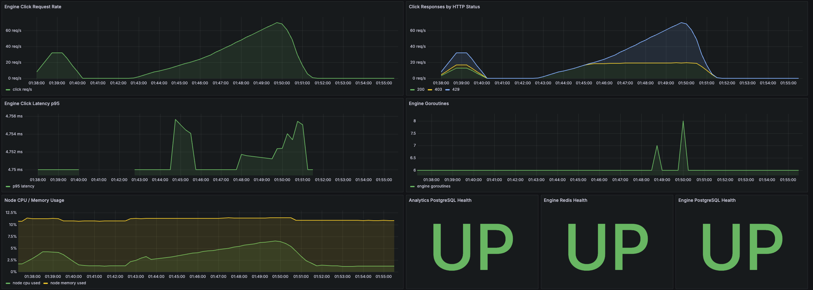

# Week 6 DevOps Report

## What I implemented

This week I added a real monitoring path and a reproducible load-test path for the deployed stack.

### Monitoring

I added a new internal package, `internal/observability`, and wired it into both Go services.

For `engine` and `analytics`, I added:

- `/metrics` for Prometheus scraping
- HTTP middleware that records request count and request duration
- live dependency gauges for PostgreSQL and Redis

The most important custom metrics are:

- `antifraud_http_requests_total`
- `antifraud_http_request_duration_seconds`
- `antifraud_dependency_up`

This means Prometheus now collects:

- real request rate from the application itself
- response code distribution by endpoint
- Go runtime metrics like `go_goroutines`
- dependency health from the point of view of the running service

### Docker Compose monitoring profile

I added a `monitoring` profile to `docker-compose.yml`.

It includes:

- `prometheus`
- `grafana`
- `node_exporter`

I kept it behind a Compose profile so the normal CI smoke stack stays lightweight and does not need host-level node-exporter mounts.

### Prometheus and Grafana config

I added provisioned config under `deployments/monitoring/`.

Prometheus scrapes:

- itself
- `engine:8080/metrics`
- `analytics:8081/metrics`
- `node_exporter:9100`

Grafana is preloaded with one dashboard:

- `Anti-Fraud Platform Overview`

That dashboard shows:

- click req/s
- `200 / 403 / 429` over time
- p95 click latency
- engine goroutine count
- node CPU and memory usage
- service-level Redis / PostgreSQL health

### Load test path

I added a dedicated `scripts/loadtest/` folder.

There are two k6 scenarios:

1. `k6_real_click_ramp.js`
   Uses the real `/v1/challenge` -> `/click` flow and ramps load until latency or errors rise.
2. `k6_status_mix.js`
   Generates a mixed stream of successful, rate-limited, and GeoIP-blocked traffic so the Grafana response breakdown graph is useful for screenshots.

I also added `run_k6.sh`, which:

- uses host `k6` if available
- otherwise falls back to the official Docker image
- writes a JSON summary file into `loadtest-artifacts/`

## Files changed

- `internal/observability/metrics.go`
- `cmd/engine/main.go`
- `cmd/analytics/main.go`
- `docker-compose.yml`
- `Makefile`
- `deployments/monitoring/prometheus/prometheus.yml`
- `deployments/monitoring/grafana/provisioning/datasources/prometheus.yml`
- `deployments/monitoring/grafana/provisioning/dashboards/dashboards.yml`
- `deployments/monitoring/grafana/dashboards/anti-fraud-overview.json`
- `scripts/loadtest/run_k6.sh`
- `scripts/loadtest/k6_real_click_ramp.js`
- `scripts/loadtest/k6_status_mix.js`
- `scripts/loadtest/README.md`
- `docs/MONITORING_LOADTEST.md`

## How to verify

Local monitoring:

```bash
COMPOSE_PROFILES=monitoring docker compose up --build -d
```

Open:

- `http://localhost:3000`
- `http://localhost:9091`

Run a local ramp:

```bash
bash scripts/loadtest/run_k6.sh k6_real_click_ramp.js
```

Run a mixed screenshot pass:

```bash
bash scripts/loadtest/run_k6.sh k6_status_mix.js
```

## VM run and observed result

I ran the monitoring stack on the university VM and captured one combined Grafana screenshot:



What happened on this run:

- first, I ran `k6_status_mix.js`
- after that, I ran `k6_real_click_ramp.js`

The two phases are visible on the same graph. The short earlier burst is the mixed-status scenario. The longer rising curve is the real-click ramp.

### Commands used on the VM

```bash
cd ~/apps/anti-fraud-platform
COMPOSE_PROFILES=monitoring docker compose up --build -d

BASE_URL=http://10.93.26.161:9090 \
DURATION=90s \
bash scripts/loadtest/run_k6.sh k6_status_mix.js

BASE_URL=http://10.93.26.161:9090 \
bash scripts/loadtest/run_k6.sh k6_real_click_ramp.js
```

### Result summary

For the mixed-status run:

- all scenario checks passed: `2881 / 2881`
- total HTTP rate was about `59.85 req/s`
- `p95` request latency was `2.39 ms`
- the engine returned the expected mix of `200`, `403`, and `429`

For the real-click ramp:

- the click request graph peaked at about `69.7 req/s`
- the challenge endpoint stayed stable for all requests
- `p95` HTTP latency stayed low at about `2.32 ms`
- full real-click success dropped to `7966 / 16799`, or about `47.4%`

### Technical interpretation

This run does not look like an infrastructure failure.

Redis and PostgreSQL stayed `UP` during the test. CPU stayed low, roughly in the single-digit range. Memory stayed stable. Goroutine count remained small and did not grow without bound. `p95` latency also stayed almost flat.

Because latency stayed low and dependencies stayed healthy, the main degradation point was not backend saturation. The more likely limit was the protection logic itself: the system started rejecting or flagging a larger share of traffic as the ramp increased, especially through `429` responses and failed real-click validations.

The practical conclusion for the report is:

- the platform stayed healthy and responsive at around `60 req/s` during the mixed validation run
- degradation started around `70 req/s` on the real-click ramp, but it appeared as protection-policy rejection rather than server collapse
